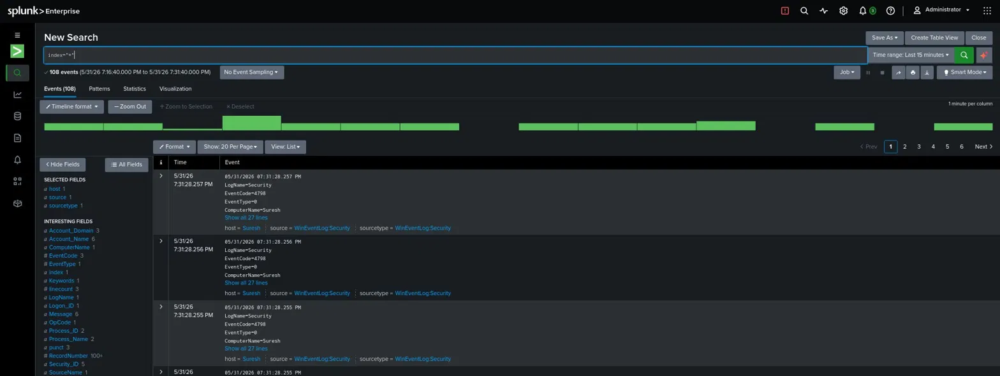

<div align="center">

# 🛡️ Splunk SOC Lab

### Windows Universal Forwarder · Deployment Server · Syslog · Firewall Monitoring

[](https://www.splunk.com)
[](https://www.kali.org)
[](#)
[](#)

> A fully operational enterprise-grade SIEM lab built from scratch — collecting, forwarding, and analyzing security logs across Windows and Linux using core Splunk components.

**Author:** Suresh Xavier — Security Operations Engineer
**Contact:** xavierreivax15@gmail.com

</div>

---

## 📌 Overview

To strengthen real-world SIEM and SOC skills, I designed and deployed a complete Splunk-based log aggregation environment using a **Windows endpoint** and a **Kali Linux virtual machine**. The goal was to replicate the log collection and forwarding pipeline found in enterprise security operations centers — manually configuring every component from forwarder deployment to centralized search and analysis.

---

## 🏗️ Lab Architecture

```
┌─────────────────────────────────────┐        ┌──────────────────────────────────────────┐
│         MACHINE 01                  │        │              MACHINE 02                  │
│         Windows Endpoint            │        │           Kali Linux VM                  │
│                                     │        │                                          │
│  ┌──────────────────────────────┐   │        │  ┌────────────────────────────────────┐  │
│  │   Splunk Universal Forwarder │───┼──9997──┼─▶│       Heavy Forwarder (:9997)      │  │
│  │   inputs.conf / outputs.conf │◀──┼──8089──┼──│       Deployment Server (:8089)    │  │
│  └──────────────────────────────┘   │        │  │       Search Head (:8000)          │  │
│                                     │        │  │       rsyslog (:514 UDP/TCP)       │  │
│  Log Sources:                       │        │  └────────────────────────────────────┘  │
│  ├── WinEventLog:Application        │        │                                          │
│  ├── WinEventLog:Security           │        │  /var/log/remote/                        │
│  ├── WinEventLog:System             │        │  ├── firewall01/                         │
│  └── pfirewall.log (Firewall)       │        │  ├── linux01/                            │
│                                     │        │  ├── router01/                           │
└─────────────────────────────────────┘        │  └── switch01/                           │
                                               └──────────────────────────────────────────┘
         Network Devices (Routers, Switches, Firewalls)
                          │
                  rsyslog UDP/TCP :514
                          │
                          ▼
               Splunk Enterprise (Kali)
```

---

## 🧰 Technologies Used

| Component | Role |
|---|---|
| Splunk Enterprise | Search Head, Heavy Forwarder, Deployment Server |
| Splunk Universal Forwarder | Log collection agent on Windows |
| Deployment Server | Centralized forwarder configuration management |
| Heavy Forwarder | Log receiving and routing (port 9997) |
| rsyslog | Syslog listener for network devices (UDP/TCP 514) |
| Windows Defender Firewall | Firewall log source (pfirewall.log) |
| Windows Event Viewer | Windows log source (Application, Security, System) |
| VMware Workstation | Virtualization platform |
| Kali Linux | Splunk server host OS |

---

## ⚙️ Configuration

### Universal Forwarder — Forwarding Target

```ini
# outputs.conf
[tcpout]
defaultGroup = splunk-server

[tcpout:splunk-server]
server = 192.168.252.128:9997
```

### Universal Forwarder — Deployment Client

```ini
# deploymentclient.conf
[target-broker:deploymentServer]
targetUri = 192.168.252.128:8089
```

### Windows Event Log Collection

```ini
# inputs.conf
[WinEventLog://Application]
disabled = 0

[WinEventLog://Security]
disabled = 0

[WinEventLog://System]
disabled = 0
```

### Windows Firewall Log Monitoring

```ini
# inputs.conf — Firewall log monitor
[monitor://C:\Windows\System32\LogFiles\Firewall\pfirewall.log]
disabled = 0
sourcetype = windows_firewall
```

> **Firewall logging enabled for:**
> - ✅ Log Dropped Packets = Yes
> - ✅ Log Successful Connections = Yes

### rsyslog — Syslog Listeners

```bash
# rsyslog.conf
module(load="imudp")
input(type="imudp" port="514")

module(load="imtcp")
input(type="imtcp" port="514")
```

---

## 🔄 Data Flow

```
Windows Event Logs
      │
      ▼
Splunk Universal Forwarder  ──────────────────────────────────────────────────────┐
      │                                                                            │
      │  TCP :9997                                               TCP :8089 (mgmt) │
      ▼                                                                            │
Heavy Forwarder                                                  Deployment Server─┘
      │
      ▼
Splunk Search Head  ◀──── rsyslog (:514) ◀──── Network Devices / Linux Servers
```

| Source | Path | Port |
|---|---|---|
| Windows Event Logs | UF → Heavy Forwarder → Search Head | 9997 |
| Windows Firewall | pfirewall.log → UF → Heavy Forwarder → Search Head | 9997 |
| Network Devices / Linux | rsyslog → Splunk Enterprise | 514 |
| Deployment Mgmt | Deployment Server → UF | 8089 |

---

## 📸 Live Proof — Splunk Search Head

The screenshot below confirms **108 Windows Security events** (EventCode 4798) successfully ingested and parsed in the Splunk Search Head, with fields like `LogName`, `EventCode`, `ComputerName`, `Account_Name`, and `sourcetype=WinEventLog:Security` fully extracted.

> 

---

## 🎯 Skills Demonstrated

<table>
<tr>
<td valign="top">

**🔧 Splunk Administration**
- Universal Forwarder deployment
- Deployment Server configuration
- Heavy Forwarder configuration
- Data onboarding & input management

</td>
<td valign="top">

**📋 Log Management**
- Windows Event Log collection
- Firewall log monitoring
- Syslog collection
- Centralized log aggregation

</td>
</tr>
<tr>
<td valign="top">

**🔍 Security Monitoring**
- Authentication event monitoring
- System activity monitoring
- Network traffic monitoring
- Firewall event analysis

</td>
<td valign="top">

**🐧 Linux Administration**
- Splunk installation on Kali Linux
- Service & port management
- rsyslog configuration
- Remote log directory structuring

</td>
</tr>
</table>

---

## ✅ Outcome

Successfully built a functional Splunk SOC lab capable of collecting and centralizing logs from **5 distinct sources**:

- [x] Windows Application Logs
- [x] Windows Security Logs
- [x] Windows System Logs
- [x] Windows Firewall Logs (pfirewall.log)
- [x] Syslog Events (UDP + TCP :514)

The lab simulates a **real-world enterprise logging architecture** and provides hands-on experience with SIEM administration, log ingestion, security monitoring, and centralized log management using Splunk.

---

## 📁 Key Files

```
splunk-soc-lab/
├── inputs.conf          # Windows Event Log + Firewall monitor inputs
├── outputs.conf         # UF forwarding target configuration
├── deploymentclient.conf  # Deployment Server registration
└── rsyslog.conf         # Syslog UDP/TCP listener config
```

---

<div align="center">

**Suresh Xavier** · Security Operations Engineer

📧 [xavierreivax15@gmail.com](mailto:xavierreivax15@gmail.com)

*Built with hands-on intent — every component manually configured.*

</div>
